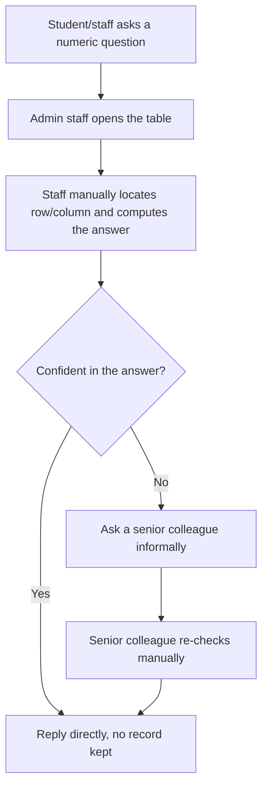
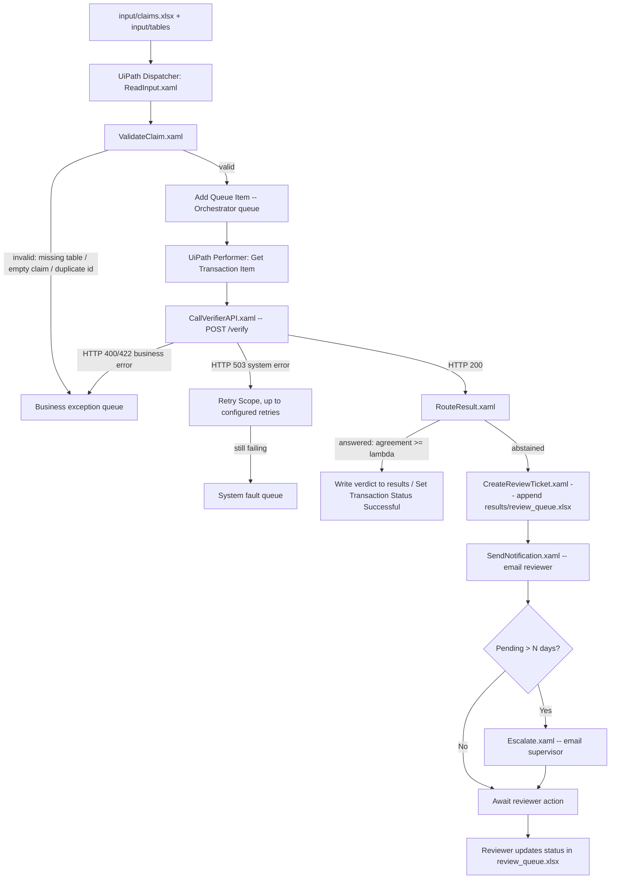

# Process Definition Document (PDD)
## Certified Numeric Verification — Institutional Fact-Checking of Numeric Claims

Project: Certified Numeric Verification (CNV)
Department: MCA, KIET Group of Institutions
Process owner (as-is): Academic/Administrative office staff who field numeric
queries about fee structures, semester results, scholarship eligibility, and
similar tabular institutional records.

## 1. As-Is Process (Manual)

### 1.1 Narrative
A student, parent, or staff member raises a numeric query about an
institutional table (e.g. "Is my total fee ₹95,000?", "Am I eligible for the
scholarship?", "What is the class average SGPA?"). An administrative staff
member manually opens the relevant spreadsheet, locates the right row/column,
computes the answer (sometimes doing arithmetic by hand — sums, averages,
comparisons), and replies by email, phone, or in person. There is no
consistent verification trail, no confidence estimate, and no systematic
escalation rule beyond "ask a senior staff member if unsure."

### 1.2 Pain Points
- **Manual arithmetic errors**: staff miscount rows, mistype totals, or
  misread a column, especially under high query volume (start of semester,
  results day, scholarship deadlines).
- **No audit trail**: there is no record of which computation produced which
  answer, so a wrong answer cannot be traced or corrected systematically.
- **Inconsistent escalation**: whether a tricky query gets a second opinion
  depends on which staff member is on duty, not on a defined risk threshold.
- **Response latency**: queries queue up behind manual lookups, especially
  for aggregate questions ("what's the average..." / "how many students...")
  that require scanning the whole table rather than one row.
- **No systematic confidence signal**: a confidently wrong verbal answer is
  indistinguishable from a correct one until someone double-checks it.

### 1.3 Inputs / Outputs (As-Is)
- Inputs: a natural-language numeric question; the relevant institutional
  table (fee structure, semester results, scholarship eligibility, etc.),
  usually an Excel/CSV export.
- Outputs: a verbal or emailed answer; no machine-readable record.

### 1.4 Business Rules (As-Is, implicit)
- Numeric tolerance for rounding is left to staff judgement.
- "Escalate to a senior staff member if unsure" is informal and undocumented.

### 1.5 As-Is Flowchart

## 2. To-Be Process (Automated, with RPA escalation)

### 2.1 Narrative
A batch of claims (from `input/claims.xlsx`, or in production, an intake
form / mailbox) is picked up by a UiPath Dispatcher, which validates each row
and enqueues it as a work item. A UiPath Performer pulls each item, calls the
`Certified Numeric Verification API` (`POST /verify`), which asks an LLM to
generate K=5 independent, machine-executable checks against the table (a
JSON "program" run by pandas — not free-text reasoning), computes an
agreement score across the K executions, and applies a pre-calibrated
conformal threshold so that the error rate among answered claims is
statistically bounded (≤ alpha). Claims above the threshold get an
immediate, auditable, "show-the-computed-number" answer. Claims below the
threshold are written to `results/review_queue.xlsx` (status = Pending) and
UiPath creates a review ticket and emails a human reviewer; if the ticket is
still Pending after N days, UiPath escalates to a supervisor.

### 2.2 Pain Points Addressed
- Numeric answers are computed by pandas execution, not asserted by an LLM
  from memory — arithmetic errors in the *verification* step are eliminated.
- Every verdict carries an agreement score and the exact executed checks
  (the "show me the number" evidence), giving a full audit trail.
- Escalation is a statistically calibrated rule (conformal risk control), not
  an informal judgement call — the workload sent to humans is quantified and
  bounded ahead of time (Results §"implied human-review workload").
- Batch processing removes the query queue bottleneck for the majority of
  claims that the system can answer confidently.

### 2.3 Automation Scope
**In scope:** claims about tabular numeric facts (fee structure, semester
results, scholarship eligibility, and structurally similar tables) expressed
as short natural-language statements, with the table supplied as a CSV.
**Out of scope:** claims requiring information not present in the supplied
table; free-text/unstructured evidence; claims requiring domain judgement
beyond arithmetic/lookup/comparison (e.g. policy interpretation of edge
cases) — these are exactly the class of claims that should abstain and reach
a human reviewer by design.

### 2.4 Inputs / Outputs (To-Be)
- Inputs: `input/claims.xlsx` (claim_id, claim, table_file), `input/tables/*.csv`,
  `config/Config.xlsx` (API URL, alpha, reviewer email, escalation days, retry
  count, file paths — see docs/SDD.md).
- Outputs: `results/review_queue.xlsx` (auditable queue of abstained claims),
  reviewer emails, escalation emails, and a per-transaction log
  (`results/logs/`), plus (optionally) a results Excel of all answered
  verdicts for the Streamlit reviewer dashboard.

### 2.5 Business Rules (To-Be, explicit)
1. A claim is **answered** iff the execution-agreement score for that claim
   is ≥ the conformal threshold lambda calibrated for the configured alpha.
2. A claim with **zero valid executed checks** (all K generations invalid or
   non-executable) is always routed to review, regardless of threshold.
3. A **missing table file**, **empty claim text**, or **unparsable CSV** is a
   **business exception** — it is logged and routed to the exception queue,
   not retried against the LLM.
4. LLM/API unavailability (HTTP 503) is a **system exception** — UiPath
   retries with backoff (Retry Scope) up to the configured retry count, then
   routes the transaction to a fault queue.
5. A review ticket left **Pending for more than N days** (Config.xlsx,
   default N=3) is escalated by email to a supervisor.
6. A **duplicate claim_id** within a batch is a business exception — the
   second occurrence is flagged, not silently processed twice.

### 2.6 To-Be Flowchart

