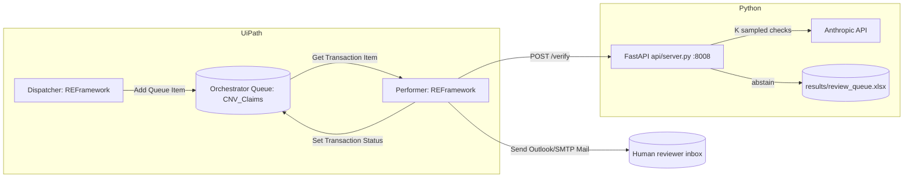

# Solution Design Document (SDD)
## Certified Numeric Verification — UiPath REFramework Design

Companion to docs/PDD.md. This document is the contract between the Python
`api/server.py` service and the UiPath automation: exact queue schema,
Config.xlsx settings, workflow list with arguments, and exception rules.

## 1. Architecture Overview

The Dispatcher reads `input/claims.xlsx` + `input/tables/*.csv`, validates
each row, and adds one Orchestrator queue item per valid claim. The Performer
processes one queue item at a time: call the API, route the result, write
the outcome, and — for abstentions — create a review ticket and notify a
human. All REFramework state (Config, transaction counters, retry counts)
follows the standard RE-Framework `Config.xlsx` + `Data/Transaction` pattern.

## 2. Orchestrator Queue Schema — `CNV_Claims`

Each queue item's `SpecificContent` (the transaction data):

| Field | Type | Source | Notes |
|---|---|---|---|
| `ClaimId` | String | claims.xlsx `claim_id` | Reference for review_queue.xlsx and dedup |
| `Claim` | String | claims.xlsx `claim` | Must be non-empty (validated at dispatch) |
| `TableFile` | String | claims.xlsx `table_file` | Resolved to `input/tables/<TableFile>` |
| `TablePath` | String | computed by Dispatcher | Absolute path passed to the API |
| `Alpha` | Double | Config.xlsx `Alpha` | Risk level, one of {0.02, 0.05, 0.10} |

Queue item **Reference** = `ClaimId` (enables Orchestrator-side duplicate
detection when "Unique Reference" is enabled — this directly implements PDD
business rule 6, duplicate claim_id).

## 3. Config.xlsx Settings Sheet

| Name | Value (example) | Used by |
|---|---|---|
| `ApiBaseUrl` | `http://127.0.0.1:8008` | CallVerifierAPI.xaml |
| `VerifyEndpoint` | `/verify` | CallVerifierAPI.xaml |
| `HealthEndpoint` | `/health` | Init state (pre-flight check) |
| `Alpha` | `0.05` | CallVerifierAPI.xaml (request body) |
| `ReviewerEmail` | `reviewer@kiet.edu` | SendNotification.xaml |
| `SupervisorEmail` | `supervisor@kiet.edu` | Escalate.xaml |
| `EscalationDays` | `3` | Escalate.xaml (Pending age threshold) |
| `ApiRetryCount` | `3` | CallVerifierAPI.xaml (Retry Scope) |
| `ApiRetryBackoffSeconds` | `5` | CallVerifierAPI.xaml (Retry Scope delay) |
| `ClaimsInputPath` | `input\claims.xlsx` | ReadInput.xaml |
| `TablesFolderPath` | `input\tables\` | ReadInput.xaml / ValidateClaim.xaml |
| `ReviewQueuePath` | `results\review_queue.xlsx` | RouteResult.xaml (read-back for escalation scan) |
| `OrchestratorQueueName` | `CNV_Claims` | Dispatcher/Performer |

Also present, per standard REFramework `Config.xlsx`: `Constants` sheet
(e.g. `MaxRetryNumber`) and `Assets` sheet (Orchestrator Credential asset for
Outlook/SMTP, if using Orchestrator-managed credentials instead of local
Outlook profile).

## 4. Workflow List (Reusable Components)

### 4.1 `ReadInput.xaml`
- **In:** `in_ClaimsInputPath` (String), `in_TablesFolderPath` (String)
- **Out:** `out_ClaimsTable` (DataTable)
- Reads `claims.xlsx` into a DataTable via Excel/Workbook "Read Range", one
  row per claim, matching the `claim_id, claim, table_file` header exactly.

### 4.2 `ValidateClaim.xaml`
- **In:** `in_ClaimRow` (DataRow), `in_TablesFolderPath` (String), `in_SeenClaimIds` (List<String>, by ref)
- **Out:** `out_IsValid` (Boolean), `out_ValidationError` (String)
- Checks, in order: `claim_id` present and not already in `in_SeenClaimIds`
  (else "duplicate claim_id"); `claim` non-empty/non-whitespace (else "empty
  claim"); `table_file` resolves to an existing file under
  `in_TablesFolderPath` (else "missing table"). Does **not** try to parse the
  CSV's contents — malformed-CSV detection is deferred to the API's 422
  response, since that check already lives in `api/server.py` and duplicating
  CSV-parsing logic in two places would drift out of sync.

### 4.3 `CallVerifierAPI.xaml`
- **In:** `in_ClaimId` (String), `in_Claim` (String), `in_TablePath` (String), `in_Alpha` (Double), `in_ApiBaseUrl` (String)
- **Out:** `out_StatusCode` (Int32), `out_ResponseJson` (JObject), `out_ErrorMessage` (String)
- Wrapped in a **Retry Scope**: retries only on system-exception status codes
  (503, connection timeout), up to `ApiRetryCount`, with
  `ApiRetryBackoffSeconds` delay. Does **not** retry on 400/422 (business
  exceptions — retrying a malformed request wastes a retry budget on an error
  that will never succeed).
- HTTP Request: `POST {in_ApiBaseUrl}/verify`, JSON body
  `{"claim_id": in_ClaimId, "claim": in_Claim, "table_path": in_TablePath, "alpha": in_Alpha}`.

### 4.4 `RouteResult.xaml`
- **In:** `in_ResponseJson` (JObject)
- **Out:** `out_Verdict` (String), `out_NeedsReview` (Boolean)
- Reads `verdict`, `sent_to_review`, `agreement_score`, `reason` from the
  API's response body. If `sent_to_review = true`, routes to
  `CreateReviewTicket.xaml` + `SendNotification.xaml`; otherwise marks the
  transaction `Successful` with the returned verdict.
- Note: the API already appends abstained claims to `review_queue.xlsx`
  server-side, so `CreateReviewTicket.xaml`'s job is the UiPath-side ticket
  (e.g. an Orchestrator "Action" / ticketing-system row), not a second write
  to the same Excel file.

### 4.5 `CreateReviewTicket.xaml`
- **In:** `in_ClaimId`, `in_Claim`, `in_TableFile`, `in_Verdict`, `in_AgreementScore`, `in_Reason` (all String/Double)
- **Out:** `out_TicketId` (String)
- Creates the human-facing ticket record (Orchestrator Action Center task,
  or a row in a ticketing sheet) referencing the same `ClaimId` used in
  `review_queue.xlsx`, so a reviewer can cross-reference both.

### 4.6 `SendNotification.xaml`
- **In:** `in_ReviewerEmail` (String), `in_ClaimId` (String), `in_Claim` (String), `in_TicketId` (String)
- **Out:** `out_Sent` (Boolean)
- Send Outlook/SMTP Mail Message activity with claim details and a link/
  reference to the ticket and to `review_queue.xlsx`.

### 4.7 `Escalate.xaml`
- **In:** `in_ReviewQueuePath` (String), `in_EscalationDays` (Int32), `in_SupervisorEmail` (String)
- **Out:** `out_EscalatedCount` (Int32)
- Run on a schedule (separate REFramework job, e.g. daily): reads
  `review_queue.xlsx`, filters `status = Pending` and
  `created_at < Now - EscalationDays`, emails `in_SupervisorEmail` a summary,
  and updates a `escalated_at` note (or a status change to `Escalated`) so
  the same ticket is not re-escalated every run.

## 5. Business vs. System Exception Rules

| Condition | API status | Exception type | UiPath action |
|---|---|---|---|
| Empty claim / missing table_file / duplicate claim_id | (caught pre-call in ValidateClaim.xaml) | Business | Log to business exception queue, `Set Transaction Status: Failed (Business)`, continue to next item |
| Malformed/unparsable table CSV | 422 | Business | Same as above (no retry) |
| `ANTHROPIC_API_KEY` unset / LLM call exhausted retries | 503 | System | Retry Scope, then `Set Transaction Status: Failed (System)`, continue after `ApiRetryCount` |
| Network/API unreachable | connection error | System | Same as 503 handling |
| Unexpected 500 | 500 | System | Retry once, then System exception |

## 6. Logging Plan

- **Python side:** every `/verify` call is logged to `results/logs/api.log`
  (claim_id, table_id, verdict, agreement score, answered/abstained,
  latency) — see `api/server.py`.
- **UiPath side:** standard REFramework logging (`Log Message`) at each
  workflow boundary: transaction start/end, validation result, API call
  result, routing decision, ticket/notification result. Log level `Info` for
  normal flow, `Warn` for business exceptions, `Error` for system exceptions
  after retries are exhausted. All logs include `ClaimId` as a correlation
  key so a single transaction can be traced end-to-end across both systems.

## 7. Retry Policy

- API-level (`src/llm_client.py`): exponential backoff with jitter on the
  Anthropic call itself (rate limits, transient connection errors), up to
  `llm.max_retries` in `config.yaml`.
- UiPath-level (`CallVerifierAPI.xaml` Retry Scope): a second, coarser retry
  layer around the whole HTTP call, for cases where the API process itself is
  restarting or briefly unreachable — independent of, and on top of, the
  Python-side retries.
